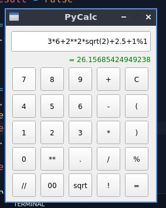

# py-calc
Calculadora feita em Python utilizando a biblioteca PyQt5 para fins de estudos sobre Python, OOP, PIP, Virtualenvs e etc. Feito com base no tutorial [Python and PyQt: Building a GUI Desktop Calculator](https://realpython.com/python-pyqt-gui-calculator).

## Instalação
Para instalar, execute:
```bash
$ git clone https://github.com/criskell/py-calc # Clonar o repositório
$ cd py-calc
$ python3.10 -m venv venv # Criar o ambiente virtual no diretório "venv"
$ source venv/bin/activate # Ativar o ambiente virtual no diretório "venv"
$ pip install -r requirements.txt # Instala os requisitos
$ python -m pycalc # Executa a calculadora
```

## Screenshots

